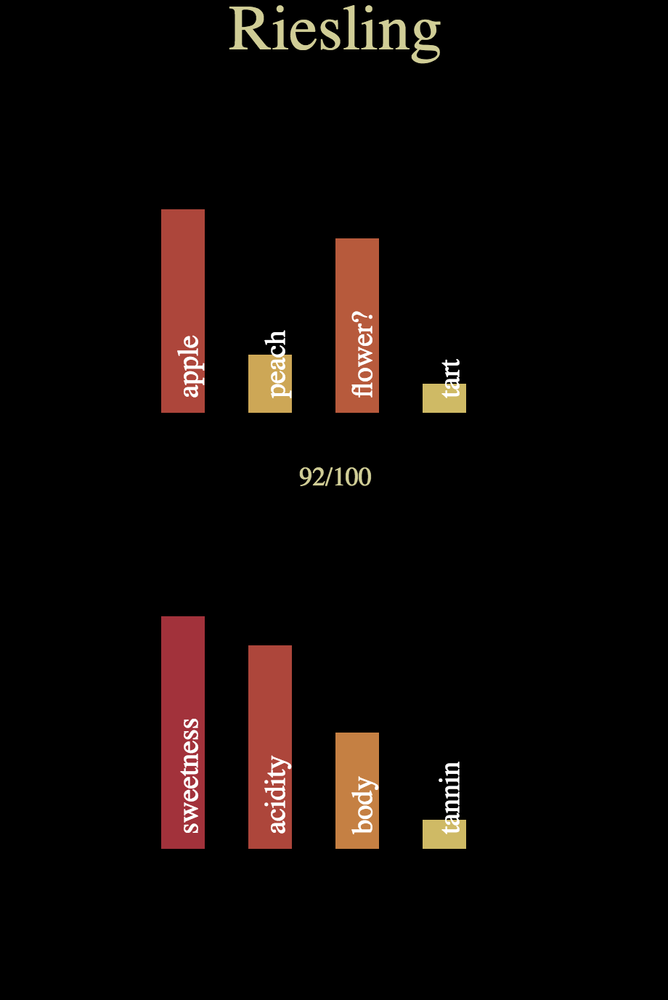
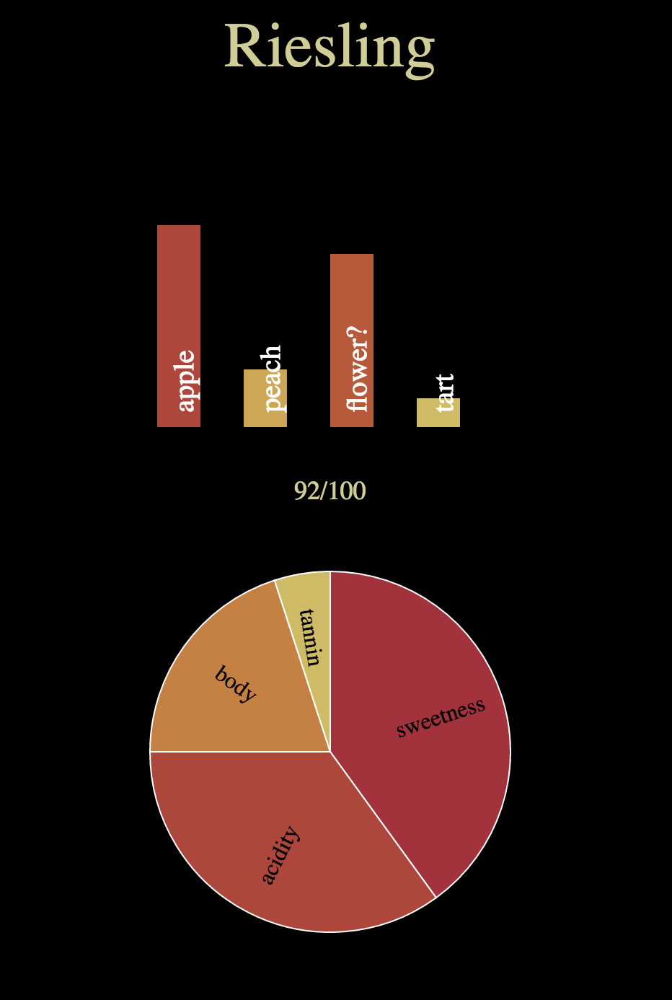

## Tasting Notes ##

Wine tasting notes are used to describe the primary flavors and characteristics of a wine. They appear in professional reviews, on bottle labels, and in notes from wine makers. Most tasting notes contain descriptive language unique to the wine community, such as when a particular flavor is detected over the course of a sip or discussing the "body" of the wine. Unfortunately, to people not well-versed in wine terminology, these notes can be difficult to understand. Sometimes, tasting notes reflect the "pretentious" attitude associated with the wine community and mention flavors that the average wine drinker would not experience.

Tasting notes can be a good resource for people who want to learn more about wine. They can be used for people looking to refine their palates to more closely match those of professional tasters. This is the type of user that I wanted to target with my project. My general goals for the project were to provide users with a way to describe a wine in their own terms and then to compare their opinions with those of professional wine tasters. 

I believe that tasting is both an individual and a group experience. Recording an individual experience of taste allows a person to become more aware of their own palate. However, they can improve their palate and learn to recognize more flavors when they understand other people's experiences with the same tasting subject. My language would be ideal for a taster with any level of experience, since they would record their individual wine tasting notes in their own words. They would then be able to access additional opinions and learn from the experiences of others. My initial intention was to create a language for users to describe the flavors of a wine and then to provide a side-by-side comparison of their flavor description with tasting notes pulled from a database. Due to various reasons outlined in this document, I produced a slightly different language. 

My final language for this project enables users to record individual notes about a wine and visualize those notes. While my DSL doesn't pull in the experiences of others, it lets the user see their opinions of a wine in a visual format. Notes for every wine are saved in files, so users can generate visualizations of multiple wines at once to compare their opinions between different experiences.

### Language Design Details ###

Writing a program in my language is a multi-step process. First, the user must specify the categories that they want to write about for any given wine. They do so by modifying "tasting_profile.txt" which is a file containing the names and types of all categories in the tasting notes. This file is then used to generate a text file with all of the categories mentioned in the tasting profile. As the user fills in these fields, they format their notes based on the type of the category. Once the user is done taking notes, they can generate a JSON object from these notes and visualize the notes in a web browser. If a category type supports multiple visualizations (i.e. if a `list` type supported both pie charts and bar graphs), the user can specify which visualization to use for that category. In general, the user writes tasting notes in a text file and writes commands in the Terminal to run a complete program.

A simultaneous advantage and disadvantage of my language is that it gives the user a lot of freedom when writing about a wine. It lets users focus on things they care about the most in tasting, which helps them more than a language that would constrain them to specific categories. It's possible to take individual tasting notes about a wine, but this language assigns those notes to user-defined categories that can then be visualized in predefined ways. The language is very open-ended and could potentially grant the user (and the developer attempting to extend it) too many options. The equivalent of a general-purpose language for wine notes would be something with a more rigorous structure. Example tasting note formats can be found in PDF format [here](http://www.wine-tastings-guide.com/support-files/wine-tasting-notes-template-3.pdf) and [here](https://www.mastersommeliers.org/sites/default/files/CERT%20Tasting%20Exam%20Grid%20WHITE-Dec2015.pdf) (Guild of Sommeliers tasting grid). 

The primary purpose of the language is to transform user data into a visual format. I implemented the language with wine tasting notes in mind, though the general computational model can be generalized to many different use cases. For example, I wrote a tool to generate flavor wheel visualizations from a text file. This used the same software stack as my DSL, though with several modifications. My DSL deals more specifically with the concept of tasting notes and how these are represented in a single object. Notes for a wine are compiled into a JSON object organized by the user-defined categories for that particular wine. Each category contains a name, a type, and data. Data is formatted differently depending on the type of that category. Currently, the language processes notes based on the type of the category specified in the tasting profile.

Currently, the language developed in the scope of this project relies heavily on the user in order to move from tasting profile to visualization. The user must first specify the desired categories they would like to describe for a wine in the tasting profile. They then must write their notes, generate the JSON object, and specify any non-default visualization categories. This is done through the commands `sniff <note_name>`, `swirl <note_name>`, and `sip <note_name>`. The first command will produce a text file for the user to fill in. If the file already exists, it will bring up the user's tasting notes to be modified. The second command generates a new JSON object from the tasting notes for that file name and produces no output. The third command opens a new web browser tab containing the visualization. Ideally, the user would be able to specify any special category visualizations in the `sip` command. However, I encountered problems passing arguments between Python and JavaScript. Rather than spend too much time focusing on this issue, I decided to let users define special visualizations in the "index.html" file for this project. 

This language includes many different pieces that need to fit together in a specific configuration in order to produce an understandable visualization. Programs can go wrong in many different ways. It is possible for users to format their notes incorrectly for certain categories. For example, if a user adds the line `profile list` to the tasting profile, the program will parse that category as a list. If the user does not write this category as a list and does not assign numerical values to each attribute in the list, the program will not produce a visualization. I tried to catch a lot of possible errors to make things easier for the user. If the user does not format their notes for a category in the appropriate style for that type, the program will print "Incorrect tasting notes formatting in categoryName". My DSL also provides error messages if users try to visualize a category with something not supported by that type. For example, if a user tried to create a special visualization where the name of a wine was displayed as a pie chart, the web browser would display an alert saying, "Incorrect visualization type for categoryName" and display the visualization using the default for that type.

The project provides support for additional development. Users can add new category types and data visualizations. The former can done by adding functionality to the JSON parser in Python for a new type and modifying the tasting profile. The latter is done by extending the visualization code with more d3 types. In general, my DSL is very unique to those domain because it places a lot of control in the hands of the user. There are some services ([primarily apps](http://www.tomsguide.com/us/best-apps-for-wine-lovers,review-2332.html)) that allow people to record wine tasting notes. Other tools such as APIs ([Snooth](https://api.snooth.com/), [vintank](http://developer.cruvee.com/)) let users query for specific wines and return a lot of information. However, my language is more user-focused. It lets users record their own impressions about a wine an access them in an adjustable visual format. Some of the aforementioned services let users store tasting notes in a very specific format and then read back through them in that same format. My project takes a more interactive approach to this concept.

### Example Programs ###

The following sample program details how someone could use the language for a wine named "riesling":

First, the user would edit the file "tasting_profile.txt" to include the following:

    name name
    flavor list
    score text
    profile list

They would then type `sniff riesling` into the Terminal, which would generate the following file named "riesling.txt":

    name
    
    
    flavor
    
    
    score
    
    
    profile
    
    

They could modify this file with their individual tasting notes. Each category would be formatted based on the type of the attribute. For the purposes of this example, list attributes are rated out of 10. The end file could look like so:

    name
    Riesling
    
    flavor
    apple 7
    peach 2
    flower? 6
    tart 1
    
    score
    92/100
    
    profile
    sweetness 8
    acidity 7
    body 4
    tannin 1

To generate the JSON object for this wine, the user would type `swirl riesling` into the Terminal. They may encounter errors if attributes are formatted incorrectly or there are new lines at the tasting notes file. If this is the case, they can re-enter the command `sniff riesling` until they can correctly swirl the wine. They would then type `sip riesling` to open a new browser with the following visualization:

If the user wants to specify an alternative visualization type for a particular category, they can add modify "index.txt". In this case, if the user wants to visualize the wine profile as a pie chart instead of a bar chart, they can include the line `special_attrs["profile"] = "pie"` in the "Special Visualization Behavior" section of the file. That would produce the following visualization:

One other feature available to the user is the ability to visualize multiple wines simultaneously under the same visualization conditions. For example, the user could type `sip riesling dslwine` and two new browser windows would open, each containing one of the two wine visualizations. Though it is not a direct comparison, it allows the user to simultaneously evaluate two wines displayed in the same manner.

### Language Implementation ###

I implemented my project in a combination of Python and JavaScript (primarily in the form of d3 visualizations). I chose to use Python because it was simple to write a lot of small, independent functions in the language. Even though I didn't have a lot of experience with it, I was able to figure out basic file reading and text parsing. I wanted users of my DSL to write their tasting notes in text files and I knew that Python would let me access these files with minimal effort. I was also able to use Python's text parsing capabilities to write a simple, extensible parser for converting the notes to JSON.

The JSON parser accepts input as a string containing the contents of a tasting notes file. It then separates the string into categories (based on spacing and new lines) and parses each category based on the type specified in the tasting profile of the wine. The parser ultimately generates a JSON object as an intermediate representation for the wine, which includes all categories of the wine as well as a category list. This list denotes the order in which the categories were written in the tasting notes file and is used to determine the order in which they are visualized.

I chose to use d3 for the visual component of my DSL because I had a small bit of past experience with it. I knew that it had the functionality to create a wide variety of visualizations. d3 also provides helpful documentation and examples that other users could reference to extend my language with additional visualizations. Since I decided to visualize the tasting notes in d3, I needed to implement JSON parsing in JavaScript. 

My language relies on a very specific file structure. I struggled to pass the tasting notes JSON object to JavaScript code where it could be visualized. My solution to this issue was to pass the file name of the tasting notes in the URL of the visualization. The JavaScript code would determine the name of the file through the URL parameter and read in the JSON file with the corresponding name. Since I chose to focus on visualizations, I did not investigate services that would handle parameter passing more efficiently. I parsed the tasting notes JSON in JavaScript by iterating through all categories of the notes and visualizing each category based on its type. I also checked whether each category was included in the `special_attrs` array, which can specify alternate visualizations for any category. 

My DSL is mainly external, since users write tasting notes for a wine in a text file. Even though this file must be formatted according to predefined types, the notes are not written in a pre-existing programming language. Since I wanted to make the tasting notes accessible to a wide variety of users, I think that an external DSL was the correct decision. The process of specifying visualizations is an internal DSL, since the user must write JavaScript code if they want to see categories in a different format than the default visualization for that category type. I think that an external DSL is ultimately the correct decision for this feature but I chose to focus my efforts on the other external DSL for the purposes of this project.

Since I developed an external DSL for writing tasting notes, the semantics of the language are very different from those of Python. I tried to stay far away from code and let users write in natural language with rating scales that made sense to them. I think that I was successful in allowing users to write short descriptions of their wine experience in language that makes sense to them. Ultimately, the language is very specific and users cannot scale their rating scales too high or else they will run into problems with visualizations. In the future, I could modify the language (especially some of the d3 code) to accept a wider range of user input and still produce consistently acceptable visualizations.

### Evaluation ###

One of the main problems I encountered over the course of the project was the extent to which my language could be considered a DSL. My original goals for the project were to produce a tool for comparing individual and professional tasting notes. I worried that this would not be enough of a DSL because there wasn't much of a need for an intermediate representation of each wine. The program probably would have displayed a list of wine notes alongside a professional wine description, which doesn't involve much language design. My final project let me specify a rough grammar for the tasting notes and parse the notes into an intermediate JSON representation. I think it is very far from a general-purpose language, primarily due to the unique code flow. The process of generating notes and visualizations is very different from anything supported by another language, primarily because I use a lot of languages and tools to accomplish the goals of the project.

I am particularly pleased with the extensibility of the tasting notes and the overall functionality of the system. I think that the language provides a good framework for users to define the categories they want to write about in tasting notes and how they want to represent each of those categories. I am also proud of the fact that I built a system which allows users to define a general tasting notes framework and then visualizes the user notes. The design challenge of building something so variable that could work in a variety of cases was very interesting to tackle.

Since my system is so complex, there is a lot of room for improvement. The process of writing tasting notes could be simplified in many ways, such as eliminating the need for a tasting profile. It would also be optimal to remove the ambiguity with type formatting. Many of these problems could be fixed with the development of a GUI. The entire project could be made into a web app in which the user could define their own categories for writing notes about a wine. They could specify the type of each category (selecting from a list of supported types) and the input form would be different based on the type. It would be possible to produce a similar intermediate representation in JSON, though with less room for error. This GUI would allow the user to include any number of categories and then produce a visualization after writing the notes. The user could even specify particular visualization formats for each category when writing the notes. It would be optimal for users to write the notes and display the visualization in the same window. They could then modify the notes and change the visualization without having to go through `swirl` and `sip` steps.

I found that the most challenging part of the project was keeping track of the various components of my system. I tried to create a system that could be extended from multiple points in the code stack. Conceptually, it was difficult for me to determine which parts should be optimized and what functionality I should include within the project duration. I eventually supported `name`, `text`, and `list` types in the Python tasting notes. Each of these types contained a corresponding d3 visualization, though the `list` type supported both bar graphs (default) and pie charts. When working on the project, it was difficult for me to determine where to spend the most time. I split my time between type support, visualizations, and general system flow. I also needed to keep track of error checking but decided to prioritize several general types of errors over a large number of specific errors. In general, I ran into trouble because the project scope became far too broad once I shifted the focus of the DSL to visualizations.

Over the course of the project, the most significant tools I used to evaluate the quality of my design were other people. I relied on the opinions of my critique partners, Prof Ben, and other friends to inform my design decisions. Coupled with my own opinions, these voices determined the direction of my project. My critique partners gave helpful input on technical decisions and provided good feedback for how users could interact with the program. Friends outside of the class contributed interesting ideas about how people would write wine tasting notes. Prof Ben was a very useful resource when I was unsure about the direction of the project or when I had questions about how tasting notes could be represented as a DSL. By combining all of these resources, I think that I was able to learn a lot about various technologies and languages in order to produce a novel project outside of my original scope.

Most of the other features I would like to include in this language relate to my original intentions for the project. I still believe that tasting is both an individual and a group experience. At a later date, I want to build a tool that allows people to write individual wine tasting notes and compare them with a group and/or professional tasters. My current project could be expanded to support this functionality by querying a database for the tasting notes of a given wine and displaying those alongside the visualization. In the future, I believe that this project could split in two different directions. The first would be the development of other DSLs using this project structure in order to generate visualizations. One example of this is the flavor wheel generator that I discussed earlier in the write up. That type of project used a similar logic flow and could be implemented entirely as a web application for user convenience. The other direction for this project would address my original goals. I could place more focus on the comparison with professional tasting notes so that users could train their palates. In general, I think that the domain of my project is remarkably unexplored and provides many interesting opportunities for innovative DSLs.
